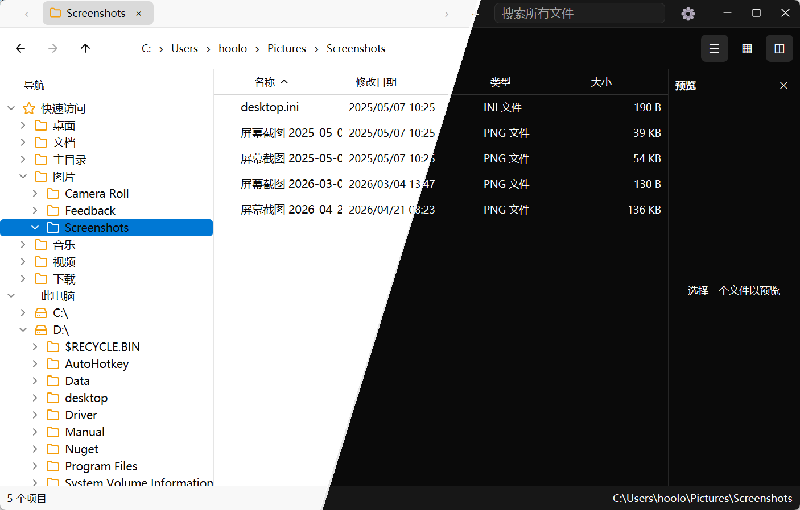

# GpuiNetShell



GpuiNetShell is a C# host for a GPUI shell runtime. It replaces the JavaScript
application layer of `gpui-shell`/`component-shell` with C#: the managed host
owns state and describes an interface, and a Rust native host owns the GPUI
application, window, event loop, validation, and materialization behind a
versioned C ABI.

The managed host declares an element tree in `View.Render`; the native host
materializes it into real `gpui-component` elements and calls back into managed
code on interaction. The element surface spans the component catalog (buttons,
inputs, trees, virtual lists, data tables, editors, menus, overlays, motion,
canvas painting, …) and the repository ships two samples: a component gallery
and a Windows 11 style file manager.

## How it fits together

```text
C# application  (View.Render -> Element builders)
        │  fills a flat render arena (nodes / ops / children / UTF-8)
        ▼
GpuiNetShell managed runtime  (RenderArena, EventRegistry, GpuiApplication)
        │  C ABI: API table + schema hash + cdecl callbacks
        ▼
gpui-net-shell native host  (Rust)
        ├─ app host: gpui::Application, window, event loop
        ├─ snapshot decode -> owned description
        ├─ style.rs: closed style vocabulary resolved to direct GPUI calls
        └─ materialize.rs -> ComponentRegistry descriptors -> materializer
```

The split mirrors `gpui-shell`: a description is published only when state
moves, and clean repaints replay the retained snapshot in Rust without entering
managed code. A built description is **prepared once**: each node's ops are
folded into a `PreparedNode` (style, payload, recorded methods, child routing),
so a repaint only builds GPUI elements. Styling is a **closed opcode
vocabulary**, not runtime reflection: the managed side sends a `u16` opcode for
each style call (`items_center`, `size_full`, `p`, `gap`, `bg`, …) and Rust maps
it to a direct GPUI style-method call. Component method names travel as numeric
codes rather than strings. The style vocabulary is declared once in `style.rs`
and mirrored in `StyleOps.cs`; a test keeps the two in step, and the native
crate no longer enables `gpui-base/inspector`.

Each published render is a frozen `RenderSnapshot` that owns its generation.
The native `ShellView` keeps the current and previous snapshots; when one is
replaced its generation is retired and the managed host releases exactly that
generation's event handlers. `View.Invalidate()` and `RenderContext.Notify()`
are the managed equivalents of `cx.notify()`: both request a native re-render.
`Notify()` is refused during `Render`, exactly as gpui refuses a self-notify
while rendering.

A managed `Entity<T>` renders as a retained native `EntityHost` subtree via
`ui.Child(entity, render)`. Event callbacks inside such a subtree do **not**
force a full repaint; only an explicit `Context.Notify()` repaints that subtree
through the native `notify_entity` ingress. The sample gallery uses this for
every stateful page (`GalleryPage<TState>`), so an interaction rebuilds one page
subtree instead of the whole window. A `[GpuiCallback]` method with signature
`Element M(TState, RenderContext, Context<TState>)` is an **entity view**: the
source generator emits a `PageToken` and registers it with
`ui.RegisterEntityView`, which `GalleryPage<TState>.Render` renders through
`ui.Child(Entity, token)`.

Native drawing and animation are first-class too. `ui.Canvas(id)` paints
through GPUI's low-level API: `PaintRect`/`PaintLine`/`PaintPath` (a compact
path DSL)/`PaintGradient`/`PaintShadow`/`PaintImage` are declarative paint
commands replayed from the retained snapshot, and `Canvas.Prepaint(token)` lets
managed code draw per frame against the canvas bounds. `HitRegion`s make a canvas
clickable/hoverable (cursor, blocking, scroll), and `Canvas.Measure(token)`
sizes it at layout time. `ui.Motion`/`ui.Presence`/`ui.Reveal` bind gpui-kit's
motion system (`transition`/`spring`/`keyframes`) to managed targets; native
interpolates and requests frames, so managed code is not involved per frame.
`[GpuiCallback]` also infers a `Measure` kind
(`string M(double, double)` → `ui.RegisterMeasure`).

The overlay host (`src/root.rs`) wraps the content view and paints one sheet, a
dialog stack, and a notification stack over it; the managed `GpuiApplication`
drives them with `OpenDialog`, `OpenSheet`, `CloseDialog`, `CloseSheet`, and
`PushNotification`, while a `Combobox` opens its option menu as a `Bottom` sheet
(one callback token per option). Tooltips ride the `gpui-component` window root.
Components are registered descriptors in `src/components/` (`Div`, `Text`,
`Button`, `Label`, `Badge`, `Progress`, `Combobox`, `Radio`, `Tabs`, `Scroll`,
`Scrollbar`, `Resizable`, `Popover`); adding one is a descriptor, a materializer,
and a managed builder. Components with named parts — a popover's `trigger` and
`content` — receive them as slots. Every overlay mutation takes the current
window and ends in `Context::notify`, and re-rendering the content is the
separate `View.Invalidate()` step.

## Repository layout

```text
Cargo.toml                     Rust workspace
crates/gpui-net-shell/         Native host (cdylib + rlib)
  src/schema.rs                  wire vocabulary (mirrored in C#)
  src/abi.rs                     C layouts and the API table
  src/snapshot.rs                arena decode + RenderSnapshot
  src/style.rs                   closed style vocabulary; direct GPUI calls
  src/registry.rs                ComponentRegistry / Descriptor / Materializer
  src/components/                one module per component in the catalog
  src/context.rs                 HostContext: session, callbacks, invalidate
  src/materialize.rs             op resolution + registry dispatch
  src/view.rs                    ShellView: dirty/current/previous + rebuild
  src/root.rs                    Root: content + sheet + dialog + notification
  src/host.rs                    GPUI application, window, ingress
  src/ffi.rs                     panic-safe C entry points
src/GpuiNetShell/              Managed runtime library
  Interop/                       layouts, P/Invoke, managed callbacks
  Rendering/                     RenderArena, RenderContext
  Entities/                      Entity<T>, Context<T>, EntityRegistry, GlobalStore, UiDispatcher
  Elements/                      Element, one builder per component, StyleExtensions
  Events/                        EventRegistry, element-event payloads
  View.cs, GpuiApplication.cs
samples/GpuiNetShell.Sample/   Tabbed component gallery (one page per component)
samples/GpuiNetShell.FileManager/  Windows 11 style file manager (custom title bar,
                               themeable accent, navigation tree, details / grid views,
                               preview pane)
tests/GpuiNetShell.Tests/      Managed contract tests
external/gpui-kit/             Pinned submodule (gpui-base/gpui-component)
docs/                          Architecture, the Button route, entity/canvas design notes
```

## Requirements

- .NET SDK 10+
- the stable Rust toolchain and Cargo
- the platform prerequisites GPUI needs

## Build and test

```sh
cargo test -p gpui-net-shell
dotnet test GpuiNetShell.slnx
dotnet build samples/GpuiNetShell.Sample/GpuiNetShell.Sample.csproj
```

Building the managed library also builds the native host (`cargo build -p
gpui-net-shell`) and copies the shared library next to the output.

On Windows the executing app must embed a Common Controls v6 manifest because
the native host imports `TaskDialogIndirect`; see
`samples/GpuiNetShell.Sample/app.manifest`.
`GpuiNativeHost.Verify()` is a quick way to check the load path without opening
a window.

## Run

```sh
dotnet run --project samples/GpuiNetShell.Sample            # opens the window
dotnet run --project samples/GpuiNetShell.Sample -- --check # ABI/schema check
dotnet run --project samples/GpuiNetShell.FileManager       # file manager
```

## Small application

State lives in an `Entity<TState>` and the content is rendered from it through
an entity-view callback, so a `Context<TState>.Notify()` repaints only that
subtree instead of the whole window.

```csharp
using GpuiNetShell;
using GpuiNetShell.Elements;
using GpuiNetShell.Entities;
using GpuiNetShell.Rendering;

GpuiApplication? application = null;
application = new GpuiApplication(() => new CounterView(application!));
application.Run();

internal sealed class CounterState
{
    public int Count { get; set; }
}

[GpuiCallbacks]
internal sealed partial class CounterView : View
{
    private readonly GpuiApplication _application;
    private Entity<CounterState>? _entity;

    public CounterView(GpuiApplication application) => _application = application;

    private Entity<CounterState> Entity =>
        _entity ??= _application.New<CounterState>(_ => new CounterState());

    protected override Element Render(ref RenderContext ui)
    {
        // Registers this class's [GpuiCallback] methods once, then renders the
        // entity subtree through its generated token.
        RegisterGeneratedCallbacks(ref ui);
        return ui.Child(Entity, PageToken);
    }

    // An entity view: state in, elements out. The generator infers this kind
    // from the (TState, RenderContext, Context<TState>) signature.
    [GpuiCallback("Page")]
    private Element RenderPage(CounterState state, RenderContext ui, Context<CounterState> cx) =>
        ui.VStack(
                ui.Text($"Count: {state.Count}").TextSize(24),
                ui.Button("increment")
                    .Label("Increment")
                    .Primary()
                    .OnClick(() => Entity.Update((s, cx) =>
                    {
                        s.Count++;   // mutate the entity
                        cx.Notify(); // the only thing that repaints this subtree
                    }))
            )
            .Gap(12)
            .P(24)
            .Full()
            .ItemsCenter()
            .JustifyCenter();
}
```

`OnClick` runs on the native application thread. Mutating `Entity<TState>` does
**not** repaint by itself: the handler must call `Context<TState>.Notify()`,
which routes through the native `notify_entity` ingress and re-runs only this
subtree's renderer. (A component callback may also invalidate the window, but
that merely replays the retained snapshot without re-running the entity
renderer, so the shown state would stay stale.) State outside an entity — such
as the custom title bar, which is rendered from the main snapshot — instead
needs `View.Invalidate()` to repaint the window.

